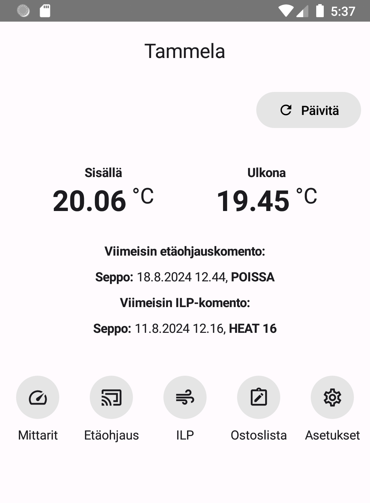
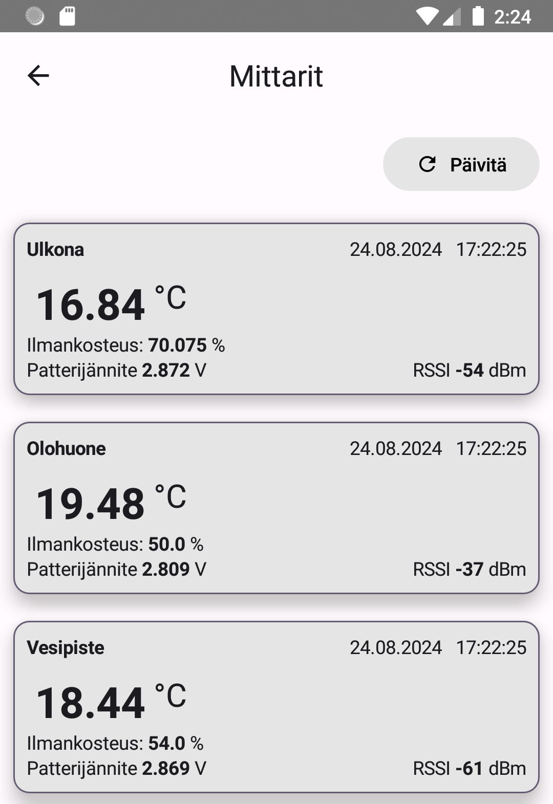
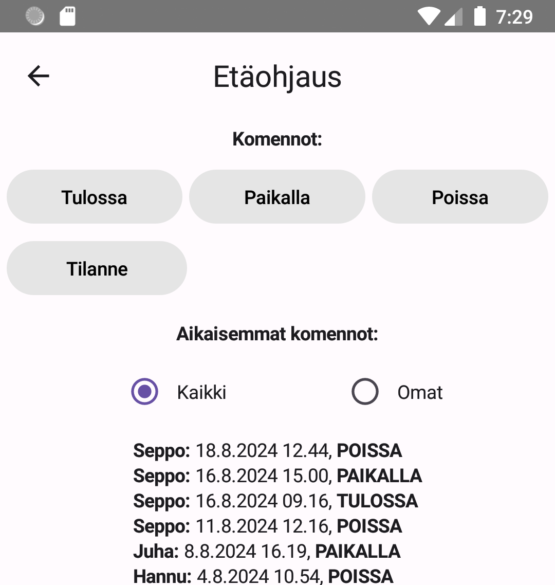
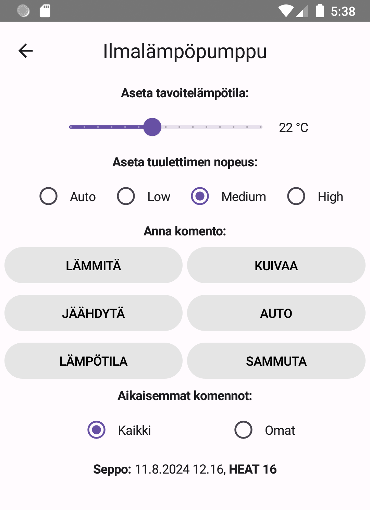
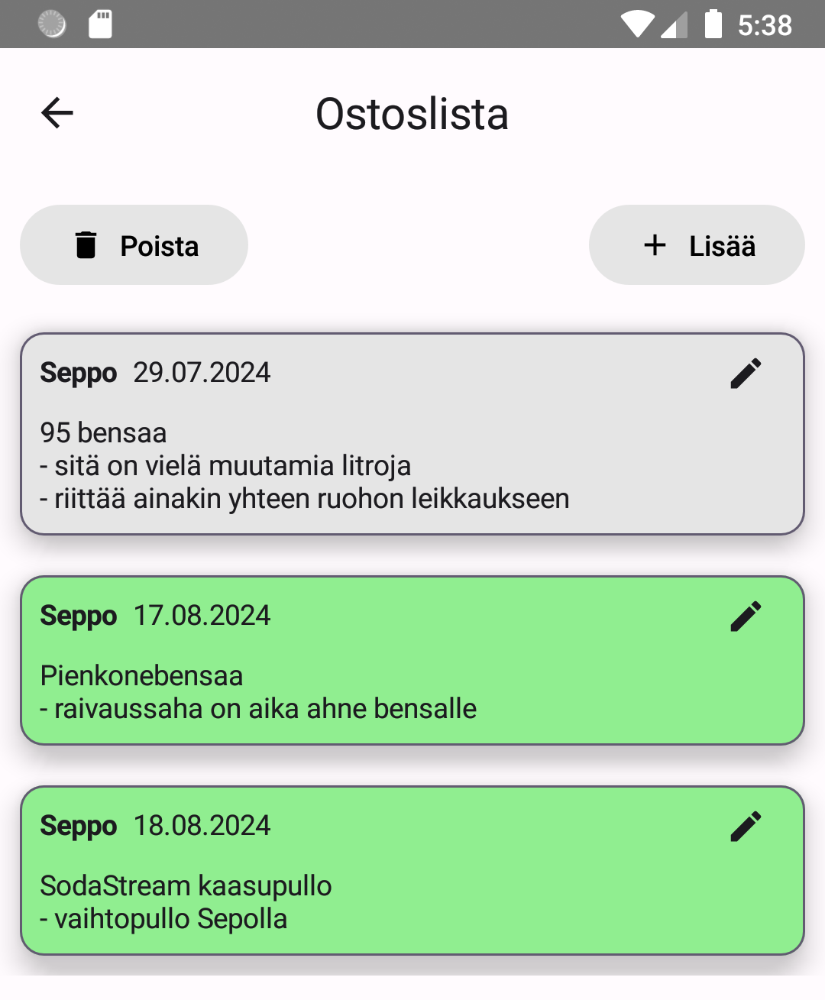
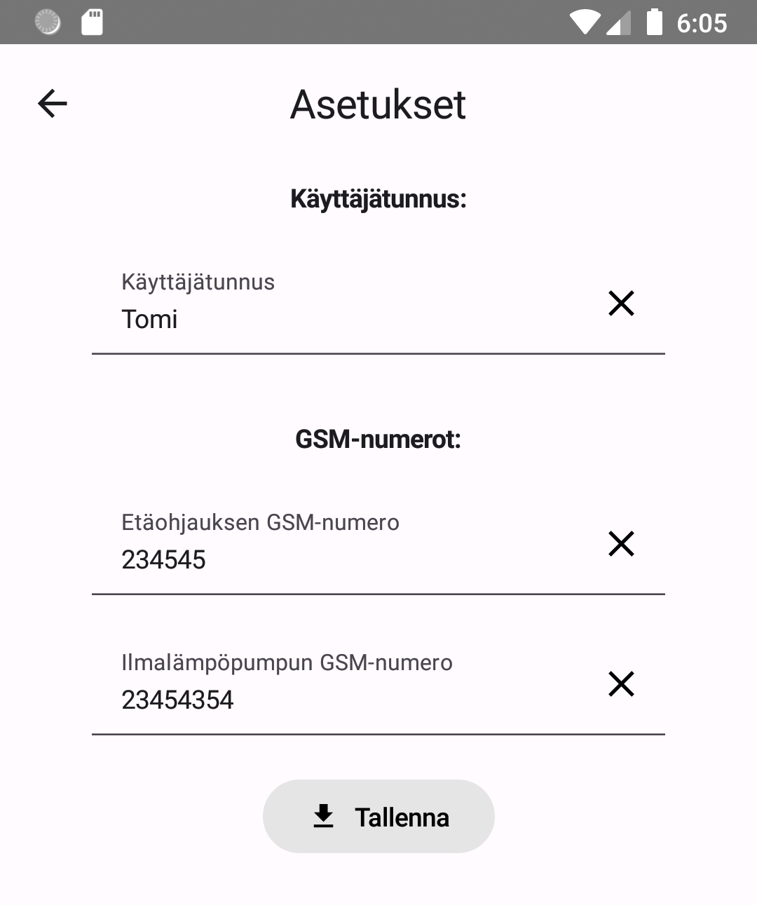

# Tammela sovellus

Tammela sovellus on Android-sovellus, jolla ohjataan ja seurataan Kiinteistöyhtymä Tammelan laitteistoja ja tarjotaan yhtymän käyttäjille helpottavia toimintoja.
Näitä ovat mittauslaitteiden seuranta, ilmalämpöpumpun ja seurantajärjestelmän ohjaus, sekä ostoslistaan lisääminen ja poistaminen.

## Käyttöohjeet

### Etusivu

### Mittarit

### Etäohjaus

### ILP (Ilmalämpöpumppu)

### Ostoslista

### Asetukset

